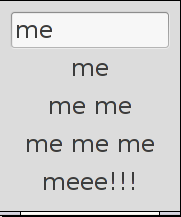

# Prog-select

Very simple gtk program that selects from commands. Pressing tab, the commands
get listed according to the number of times they were chosen.(which is stored 
in  `~/.prog-select`.)

Better stuff available. Tab completion on typical terminal applications is
nearly as good! Hey, this is the 'random crap' folder.(it also produces a lot 
of warnings)

Screenshot, with just some random stuff i entered.
(because it didnt have anything in the lists because i dont use it)

